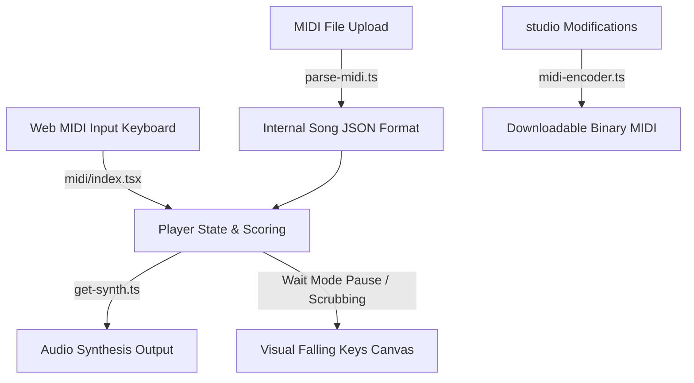

# Loomo Architecture & Overview

Loomo is a democratized, web-based instrument practice and music editing platform designed for absolute beginners. While a MIDI keyboard provides the optimal plug-and-play experience, Loomo is instrument-agnostic and can be used with virtual inputs or other MIDI controllers.

---

## Core Motivation

Learning an instrument is historically challenging, with nearly 90% of beginners quitting within their first year due to the friction of reading traditional sheet music, expensive tutoring, and the steep learning curve of digital audio workstations. Loomo's core motivation is to democratize music education and creation by providing complete beginners with intuitive visual interfaces and instant play-along feedback, removing financial and cognitive barriers to entry.

---

## Core Workflows & Use Cases

Loomo coordinates learning, practicing, and editing music into a simple, iterative loop:

1. **Upload and Import:** Users upload their own MIDI files or select from the pre-loaded library.
2. **Review and Edit (studio):** Before practicing, users can open the **studio** to review note placements, adjust pitch and timing, or delete/add notes on a clean, visual grid without the clutter and complexity of a professional DAW.
3. **Practice and Play (play mode):** Users connect their MIDI instrument or keyboard and play along. Instead of reading traditional notation, notes are represented as flowing keys aligned with the keys of an on-screen keyboard, where the block's length corresponds to the note's duration.
4. **Feedback and Score:** As users play, Loomo provides instant color-coded visual feedback. At the end of the session, the scoring engine shows their accuracy, helping them reiterate until they master the track.
5. **Slow Practice & Learning:** Users can slow down the tempo or turn on **Wait Mode**, which freezes the timeline and waits for them to hit the correct note before proceeding, making learning complex pieces stress-free.

---

## Tech Stack

Loomo is built as a client-side Single Page Application (SPA) using **React**, **Vite**, and **TypeScript** for quick compilation, fast load times, and a responsive layout. The audio layer leverages the browser's native **Web Audio API** and **Web MIDI API** to process real-time input and output without external server latency, while utilizing **Tone.js** and Soundfonts for polyphonic instrument synthesis. **Jotai** manages light, reactive state atoms that sync playback, scoring, and UI controls efficiently. The interactive visualizations (like the scrolling keys in play mode) are rendered on an HTML5 **Canvas**, utilizing **requestAnimationFrame** to ensure smooth 60fps animations.

---

## Architectural Style & Design Patterns

For developers and musician-developers looking under the hood, Loomo is structured as a client-side React SPA powered by Vite and TypeScript, built around three design principles:

1. **Feature-Sliced Architecture:** Code is modular and separated by domain. High-level routes reside in `pages/` (such as the play mode and studio views), business rules and device controllers live in `features/`, and simple visual blocks are in `components/`.
2. **Reactive State (Jotai):** Application state (current play state, note scores, active keys, and configuration toggles) is managed via decoupled Jotai atoms. This prevents massive UI re-renders and lets core audio controllers trigger visual changes instantly.
3. **Game-Loop Canvas Drawing:** Visual assets (flowing keys, indicators) are drawn directly onto an HTML5 Canvas using a high-precision `requestAnimationFrame` loop. This bypasses the DOM completely, ensuring smooth 60fps animations during playback.

---

## Musician-Developer Deep Dive

For creators looking to hack Loomo, route its signals, or understand its mathematics, here is a detailed breakdown of the scoring engine and MIDI routing systems:

### 1. The Scoring Engine Algorithm

The core player logic in [player.ts](file:///Users/ardakocaman/Documents/Development/loomo/src/features/player/player.ts) compares the user's active MIDI input events against the notes parsed from the file. It evaluates timing accuracy using two configurable tolerance windows:
- **Perfect Window (`perfectRange`):** The narrowest timing window surrounding the target start time of a note.
- **Good Window (`goodRange`):** The wider timing window surrounding the target start time of a note.

#### Hits & Colors Feedback
- **Perfect:** Note played within the tight `perfectRange` window of the note's target start time. Registered as `perfect` and colored **Green** on the canvas.
- **Late:** Note played after the `perfectRange` has elapsed, but still within the broader `goodRange` window after the target start. Registered as `late` and colored **Purple**.
- **Early:** Note played before the note's start time, within the broader `goodRange` window. Registered as `early` and colored **Yellow**.
- **Error:** Pressed keys that do not correspond to any active/upcoming notes. Registered as `error` and colored **Red**, resetting the active streak to `0`.

#### Points Math
Scores are calculated reactively via Jotai atoms using the following formulas:
$$\text{combined} = (\text{perfect} \times 100) + (\text{good} \times 50) - (\text{error} \times 25) + \text{durationHeld}$$
*(where $\text{good} = \text{early} + \text{late}$ and $\text{durationHeld}$ is a bonus score accumulated by holding note keys for their correct duration)*

$$\text{accuracy (\%)} = \frac{\text{perfect} + 0.5 \times (\text{early} + \text{late})}{\text{perfect} + \text{early} + \text{late} + \text{missed}} \times 100$$

---

### 2. Wait Mode Mechanics

Wait Mode turns Loomo into an interactive tutor by halting playback until the user hits the right note.

Inside the scheduling loop of [player.ts](file:///Users/ardakocaman/Documents/Development/loomo/src/features/player/player.ts), when a note's target timestamp matches or falls behind the current play position (`song.notes[this.currentIndex].time < currentSongTime`), the player inspects whether that note belongs to an active channel or hand selection. 

If **Wait Mode** is enabled and the note has not been hit yet:
```typescript
if (this.wait && !this.hitNotes.has(note)) {
  this.currentSongTime = note.time;
  return; // Halts playback progression
}
```
This forces the timeline to freeze at `note.time`. The moment the user strikes the corresponding note on their instrument, the event listener adds the note to the `hitNotes` set. On the very next animation frame, the conditional block resolves as true, the loop continues, and playback resumes seamlessly until the next target note is reached.

---

### 3. MIDI Routing & External DAW / VST Integration

In addition to playing sound files through standard internal synthesizer Soundfonts, Loomo has built-in support for **external MIDI routing**.

In [index.tsx](file:///Users/ardakocaman/Documents/Development/loomo/src/features/midi/index.tsx), Loomo accesses the browser's native Web MIDI API to manage both inputs and outputs:
- **MIDI Inputs:** Real-time listeners bind to hardware controllers (keyboards, pads, electronic drums) to capture Note On (command `0x9`) and Note Off (command `0x8`) messages.
- **MIDI Outputs:** When notes are played during song playback, or when a user presses keys on the virtual keyboard, Loomo broadcasts those events to all connected and enabled virtual MIDI output buses or hardware ports.

#### DAW / VST Setup Example
You can route Loomo's output directly into digital audio workstations (like Ableton Live, Logic Pro, FL Studio, or Reaper) to trigger high-end virtual instruments (VSTs/AU plugins like Serum, Kontakt, or Omnisphere):
1. **Enable MIDI Output:** In Loomo, select a virtual MIDI bus (such as IAC Driver on macOS, or loopMIDI on Windows) as your output device.
2. **Configure your DAW:** Set your DAW's MIDI input port to listen to that same virtual MIDI bus.
3. **Trigger VSTs:** Load your favorite software synth or plugin inside your DAW. Playback from Loomo will trigger your VSTs in real-time, giving you premium sound design possibilities.

---

## Top-Down Summary (Layered Structure)

The project logic flow goes from high-level routing down to utility libraries:

1. **Pages (`src/pages/*`)**: Orchestrate screen features (e.g. play mode screen, studio screen).
2. **Features (`src/features/*`)**: Contain raw business logic, state atoms, sound synth systems, and file parsers.
3. **Components (`src/components/*`)**: Reusable UI parts (buttons, modals, sliders) that do not know about song state.
4. **Hooks & Styling (`src/hooks/*`, `src/styles/*`)**: Shared triggers (resizing, animations) and core layout styling tokens.

---

## MIDI Processing & Audio Synthesis Flow

Loomo handles MIDI data in three main stages:



1. **Parsing MIDI Files:** Raw uploaded binary data is converted into JSON using [parse-midi.ts](file:///Users/ardakocaman/Documents/Development/loomo/src/features/parsers/parse-midi.ts). This formats notes, tracks, tempos, and time signatures into standard TypeScript interfaces ([types.ts](file:///Users/ardakocaman/Documents/Development/loomo/src/types.ts)).
2. **Real-time MIDI Input:** When a user plays keys on a MIDI device, [index.tsx](file:///Users/ardakocaman/Documents/Development/loomo/src/features/midi/index.tsx) catches real-time "Note On" and "Note Off" events.
3. **Audio Output & External Routing:** Triggered notes are sent to [get-synth.ts](file:///Users/ardakocaman/Documents/Development/loomo/src/features/synth/get-synth.ts) to play on-board Soundfont voices, and concurrently broadcast to external ports for VST synth routing.
4. **Re-Encoding to MIDI:** Changes made in the **studio** timeline editor are written back into standard MIDI binary files via [midi-encoder.ts](file:///Users/ardakocaman/Documents/Development/loomo/src/features/studio/midi-encoder.ts) so users can download their modifications.

---

## File Interactions & System Integration

When a user practices or edits a song, the system files coordinate as follows:

```
                                +---------------------------+
                                |      src/pages/play/      |
                                |       (Or studio)         |
                                +-------------+-------------+
                                              | Orchestrates
                                              v
+--------------------------+    +-------------+-------------+    +--------------------------+
|  src/features/parsers/   |--->|   src/features/player/    |<---|    src/features/midi/    |
|   (Reads MIDI files)     |    | (Keeps playback/wait state|    |  (Reads MIDI keyboards)  |
+--------------------------+    +-------------+-------------+    +--------------------------+
                                              | Updates
                                              v
+--------------------------+    +-------------+-------------+    +--------------------------+
|   src/features/synth/    |<---|    Jotai Global Atoms     |--->|  src/features/drawing/   |
| (Plays Instrument audio) |    |  (Triggers synth/drawings)|    | (Draws Piano & Falling)  |
+--------------------------+    +---------------------------+    +-------------+------------+
                                                                               | Renders
                                                                               v
                                                                 +-------------+------------+
                                                                 |  src/components/Canvas   |
                                                                 |  (Draws frames in browser)|
                                                                 +--------------------------+
```

---

## Architectural View (Top-Down File Directory)

Below is a top-down look at how the files in the `src/` directory are structured and what each one does:

### Root Level
- [types.ts](file:///Users/ardakocaman/Documents/Development/loomo/src/types.ts): Contains global TypeScript interfaces for songs, notes, measures, playback stats, and configurations.
- [ambient-types.d.ts](file:///Users/ardakocaman/Documents/Development/loomo/src/ambient-types.d.ts): Declares custom browser or environment types (like MIDI ports).

---

### Pages (`src/pages/`)
Defines the main screens and visual layout of the application.

- **`home/`**
  - [page.tsx](file:///Users/ardakocaman/Documents/Development/loomo/src/pages/home/page.tsx): The dashboard landing page where users choose songs, upload MIDI files, or navigate to other modes.
- **`play/`**
  - [page.tsx](file:///Users/ardakocaman/Documents/Development/loomo/src/pages/play/page.tsx): The main interactive play-along screen.
  - **`components/`**
    - [MidiModal.tsx](file:///Users/ardakocaman/Documents/Development/loomo/src/pages/play/components/MidiModal.tsx): Pop-up selector to connect and toggle external MIDI devices.
    - [StatsPopup.tsx](file:///Users/ardakocaman/Documents/Development/loomo/src/pages/play/components/StatsPopup.tsx): Displays accuracy, note hits/misses, and final scores after a song ends.
    - [StatusIcon.tsx](file:///Users/ardakocaman/Documents/Development/loomo/src/pages/play/components/StatusIcon.tsx): Simple icon indicators for playback and MIDI connectivity.
    - [TopBar.tsx](file:///Users/ardakocaman/Documents/Development/loomo/src/pages/play/components/TopBar.tsx): Top navigation bar containing tempo adjustments, hand selection, and play controls.
    - [TrackHUD.tsx](file:///Users/ardakocaman/Documents/Development/loomo/src/pages/play/components/TrackHUD.tsx): Heads-up display indicating which notes and tracks are currently active.
- **`studio/`**
  - [page.tsx](file:///Users/ardakocaman/Documents/Development/loomo/src/pages/studio/page.tsx): The visual MIDI editor timeline where users click and drag to change note pitch, timing, volume, or delete/add notes.
- **`songs/`**
  - [page.tsx](file:///Users/ardakocaman/Documents/Development/loomo/src/pages/songs/page.tsx): List overview of all saved, pre-loaded, and custom-imported tracks.
  - **`components/Table/`**: Table components ([Table.tsx](file:///Users/ardakocaman/Documents/Development/loomo/src/pages/songs/components/Table/Table.tsx), [TableHead.tsx](file:///Users/ardakocaman/Documents/Development/loomo/src/pages/songs/components/Table/TableHead.tsx), [types.ts](file:///Users/ardakocaman/Documents/Development/loomo/src/pages/songs/components/Table/types.ts)) used to sort, search, and manage songs list.
- **`freeplay/`**
  - [page.tsx](file:///Users/ardakocaman/Documents/Development/loomo/src/pages/freeplay/page.tsx): A sandbox page allowing users to play instruments freely on the screen or with connected devices without scoring.
- **`training/`**
  - [page.tsx](file:///Users/ardakocaman/Documents/Development/loomo/src/pages/training/page.tsx): Screen for learning techniques and speed drills.
  - [sound-effects.ts](file:///Users/ardakocaman/Documents/Development/loomo/src/pages/training/sound-effects.ts): Small utility to trigger training sound effects.
- **Routing & Providers**
  - [routes.ts](file:///Users/ardakocaman/Documents/Development/loomo/src/pages/routes.ts): Maps application URLs to their respective page components.
  - [root.tsx](file:///Users/ardakocaman/Documents/Development/loomo/src/pages/root.tsx): Initializes global route wrappers, layouts, and page context setups.
  - [providers.tsx](file:///Users/ardakocaman/Documents/Development/loomo/src/pages/providers.tsx): Exposes shared application state providers to components.

---

### Features (`src/features/`)
Self-contained functional modules for audio, MIDI, persistence, drawing, and visualization.

- **`player/`**
  - [player.ts](file:///Users/ardakocaman/Documents/Development/loomo/src/features/player/player.ts): The main engine of the app. It tracks current playback time, calculates scores, coordinates notes with the synthesizer, and pauses automatically when "Wait Mode" is active.
  - [context.tsx](file:///Users/ardakocaman/Documents/Development/loomo/src/features/player/context.tsx): React context helper to share the player instance across visual components.
- **`SongVisualization/`**
  - [SongVisualizer.tsx](file:///Users/ardakocaman/Documents/Development/loomo/src/features/SongVisualization/SongVisualizer.tsx): Renders the main rolling animation container.
  - [canvas-renderer.ts](file:///Users/ardakocaman/Documents/Development/loomo/src/features/SongVisualization/canvas-renderer.ts): Coordinates the browser animation frames to keep visuals smooth.
  - [falling-notes.ts](file:///Users/ardakocaman/Documents/Development/loomo/src/features/SongVisualization/falling-notes.ts): Draws the falling notes representation on the canvas, aligning them with the piano keys.
  - [touchscroll.ts](file:///Users/ardakocaman/Documents/Development/loomo/src/features/SongVisualization/touchscroll.ts): Enables horizontal or vertical touch and swipe scrubbing.
  - [images.ts](file:///Users/ardakocaman/Documents/Development/loomo/src/features/SongVisualization/images.ts): Loads background visual assets and textured noise pattern overlays.
  - [utils.ts](file:///Users/ardakocaman/Documents/Development/loomo/src/features/SongVisualization/utils.ts): Math calculators for sizes, zoom factors, and note position offsets.
- **`drawing/`**
  - [piano.ts](file:///Users/ardakocaman/Documents/Development/loomo/src/features/drawing/piano.ts): Renders the static and interactive piano keys at the bottom of the play screen.
  - [sheet.ts](file:///Users/ardakocaman/Documents/Development/loomo/src/features/drawing/sheet.ts): Renders general sheet music guide markers.
  - [utils.ts](file:///Users/ardakocaman/Documents/Development/loomo/src/features/drawing/utils.ts): Direct canvas drawing helpers for custom rounded corners, rects, and lines.
- **`parsers/`**
  - [parse-midi.ts](file:///Users/ardakocaman/Documents/Development/loomo/src/features/parsers/parse-midi.ts): Parses raw MIDI data into Loomo's internal formats (identifying notes, tempo BPMs, tracks, and measures).
  - [parse-xml.ts](file:///Users/ardakocaman/Documents/Development/loomo/src/features/parsers/parse-xml.ts): Parses MusicXML files.
  - [utils.ts](file:///Users/ardakocaman/Documents/Development/loomo/src/features/parsers/utils.ts): Helper tools for note frequencies and time conversions.
- **`synth/`**
  - [get-synth.ts](file:///Users/ardakocaman/Documents/Development/loomo/src/features/synth/get-synth.ts): Initializes the synthesizer using sound fonts and manages audio channel outputs.
  - [instruments.ts](file:///Users/ardakocaman/Documents/Development/loomo/src/features/synth/instruments.ts): Lists and maps general MIDI instrument definitions.
  - [loadInstrument.ts](file:///Users/ardakocaman/Documents/Development/loomo/src/features/synth/loadInstrument.ts): Lazily fetches instrument sound samples from online resources.
  - [utils.ts](file:///Users/ardakocaman/Documents/Development/loomo/src/features/synth/utils.ts): Audio context initialization helpers.
- **`midi/`**
  - [index.tsx](file:///Users/ardakocaman/Documents/Development/loomo/src/features/midi/index.tsx): Handles browser Web MIDI connection to detect and listen to external MIDI keyboards.
- **`persist/`**
  - [persistence.ts](file:///Users/ardakocaman/Documents/Development/loomo/src/features/persist/persistence.ts): Manages saving uploaded songs and selected local folders using IndexedDB.
  - [storage.ts](file:///Users/ardakocaman/Documents/Development/loomo/src/features/persist/storage.ts): Custom fallback storage wrappers.
  - [constants.ts](file:///Users/ardakocaman/Documents/Development/loomo/src/features/persist/constants.ts): Keys used for IndexedDB entries.
- **`controls/`**
  - [AdjustInstruments.tsx](file:///Users/ardakocaman/Documents/Development/loomo/src/features/controls/AdjustInstruments.tsx): Side panel to tweak specific track volumes, select hands, or mute channels.
  - [SongScrubBar.tsx](file:///Users/ardakocaman/Documents/Development/loomo/src/features/controls/SongScrubBar.tsx): Slider controls at the bottom to jump to different points of the track.
  - [VolumeSliderButton.tsx](file:///Users/ardakocaman/Documents/Development/loomo/src/features/controls/VolumeSliderButton.tsx): Master audio volume controller.
- **`data/`**
  - [index.tsx](file:///Users/ardakocaman/Documents/Development/loomo/src/features/data/index.tsx): Global state logic linking songs list and persistence.
  - [library.tsx](file:///Users/ardakocaman/Documents/Development/loomo/src/features/data/library.tsx): Contains the default offline catalog of playable tracks.
- **`SongPreview/`**
  - [SongPreview.tsx](file:///Users/ardakocaman/Documents/Development/loomo/src/features/SongPreview/SongPreview.tsx): Plays short sound clips of songs on the dashboard.
  - [SongPreviewModal.tsx](file:///Users/ardakocaman/Documents/Development/loomo/src/features/SongPreview/SongPreviewModal.tsx): Modal overview details and difficulty previews for tracks.
- **`theory/`**
  - [procedural.ts](file:///Users/ardakocaman/Documents/Development/loomo/src/features/theory/procedural.ts): Formulates basic scales, chord patterns, and key transposition logic.
  - [key-signature.ts](file:///Users/ardakocaman/Documents/Development/loomo/src/features/theory/key-signature.ts): Computes musical key signatures.
  - [glyphs.ts](file:///Users/ardakocaman/Documents/Development/loomo/src/features/theory/glyphs.ts): Shapes and positions for visual sheet symbols.
- **`pointer/`**
  - [index.ts](file:///Users/ardakocaman/Documents/Development/loomo/src/features/pointer/index.ts): Standardizes mouse cursor and screen tap touch movements.
- **`wakelock/`**
  - [index.ts](file:///Users/ardakocaman/Documents/Development/loomo/src/features/wakelock/index.ts): Uses the Screen Wake Lock API to prevent screens from sleeping during practice.
- **`analytics/`**
  - [index.ts](file:///Users/ardakocaman/Documents/Development/loomo/src/features/analytics/index.ts): Sends anonymous metrics to help debug app issues.

---

### Shared Layout & UI Components (`src/components/`)
Re-usable visual interface widgets.

- [MainLayout.tsx](file:///Users/ardakocaman/Documents/Development/loomo/src/components/MainLayout.tsx): Shared master wrapper structure featuring the application header.
- [AppBar.tsx](file:///Users/ardakocaman/Documents/Development/loomo/src/components/AppBar.tsx): Top header containing branding and page navigation shortcuts.
- [Canvas.tsx](file:///Users/ardakocaman/Documents/Development/loomo/src/components/Canvas.tsx): Handles rendering HTML5 canvas wrappers with automatic resize listener updates.
- [MovablePopup.tsx](file:///Users/ardakocaman/Documents/Development/loomo/src/components/MovablePopup.tsx): Floating popup windows that can be moved or dragged.
- [Modal.tsx](file:///Users/ardakocaman/Documents/Development/loomo/src/components/Modal.tsx): Standard modal backdrop container.
- [UploadMidi.tsx](file:///Users/ardakocaman/Documents/Development/loomo/src/components/UploadMidi.tsx): Interactive drag-and-drop midi file loader area.
- Other widgets: [Dropdown.tsx](file:///Users/ardakocaman/Documents/Development/loomo/src/components/Dropdown.tsx), [Select.tsx](file:///Users/ardakocaman/Documents/Development/loomo/src/components/Select.tsx), [Slider.tsx](file:///Users/ardakocaman/Documents/Development/loomo/src/components/Slider.tsx), [TextInput.tsx](file:///Users/ardakocaman/Documents/Development/loomo/src/components/TextInput.tsx), [Toggle.tsx](file:///Users/ardakocaman/Documents/Development/loomo/src/components/Toggle.tsx), [Tooltip.tsx](file:///Users/ardakocaman/Documents/Development/loomo/src/components/Tooltip.tsx).

---

### Global Custom Hooks (`src/hooks/`)
Standardized React helper hooks for standard tasks.

- [useMidiInputs.ts](file:///Users/ardakocaman/Documents/Development/loomo/src/hooks/useMidiInputs.ts) & [useMidiOutputs.ts](file:///Users/ardakocaman/Documents/Development/loomo/src/hooks/useMidiOutputs.ts): Fetch and monitor available MIDI connection interfaces.
- [useRafLoop.ts](file:///Users/ardakocaman/Documents/Development/loomo/src/hooks/useRafLoop.ts): Coordinates high-speed canvas animation rendering.
- [useWhenClickedOutside.ts](file:///Users/ardakocaman/Documents/Development/loomo/src/hooks/useWhenClickedOutside.ts): Triggers modal or dropdown closure when clicking elsewhere.
- [useSize.tsx](file:///Users/ardakocaman/Documents/Development/loomo/src/hooks/useSize.tsx) & [useWindowWidth.ts](file:///Users/ardakocaman/Documents/Development/loomo/src/hooks/useWindowWidth.ts): Detect layout dimension changes dynamically.

---

### Global Styling (`src/styles/`)
Theme settings and styling configurations.

- [global.css](file:///Users/ardakocaman/Documents/Development/loomo/src/styles/global.css): Global standard style configurations, rules, and colors.
- [common.ts](file:///Users/ardakocaman/Documents/Development/loomo/src/styles/common.ts): Global design tokens, palette variables, and theme definitions.
- `fonts/`: Holds typography assets like Outfit or Inter.
